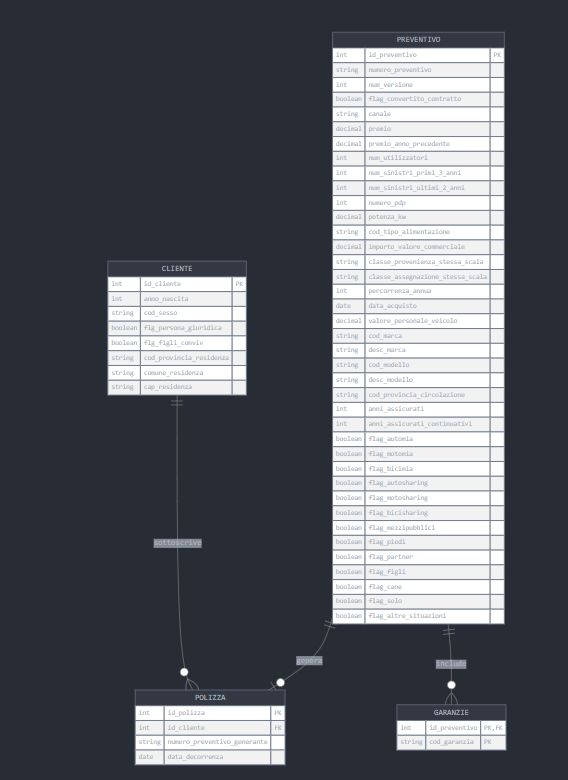

# Generali Data Challenge — Insurance Coverage Recommender System

**Hackathon** · Genertel (Generali Group) · Trieste, June 2025

A hybrid recommender system that suggests personalized optional insurance coverages to existing customers, achieving a **45% hit rate** on real-world data from one of Italy's largest insurers.

---

## Problem

Genertel's customers purchase mandatory liability coverage by default, but a large share of high-value optional coverages (theft, collision, roadside assistance, glass, natural events) go unnoticed or unprompted. The challenge was to build a data-driven system that identifies the right optional coverage to offer each customer at quote time, using historical purchase behavior and customer/vehicle profiles.

**Dataset:** ~150,000 customers · ~2 million insurance quotes · ~10.3 million coverage records (anonymized, GDPR-compliant).

---

## Solution

A **hybrid recommender** combining two complementary signals:

| Component | Method | Weight |
|---|---|---|
| Collaborative filtering | Coverage co-occurrence + cosine similarity | 60% |
| Profile-based prediction | Random Forest classifier per coverage type | 40% |

The two scores are blended at inference time. For cold-start customers with no purchase history the system falls back to the profile-based model exclusively.

**Feature engineering** distilled 61 raw quote features into 21 predictive signals across three categories:
- **Demographics** — age, gender, province, household composition
- **Vehicle** — brand, commercial value, power, fuel type
- **Behavioral** — years insured, claims history, annual mileage, usage patterns

---

## Results

| Metric | Value |
|---|---|
| Hit Rate | **45%** |
| Precision@10% | industry-standard baseline |
| NDCG | 19% |
| Coverage types modeled | 15 out of 27 |

Estimated business impact: ~855,000 potential annual upsells, representing a projected **€10M annual revenue opportunity** for Genertel.

---

## Repository Structure

```
generali_challenge/
├── src/
│   ├── data_preparation.py       # Multi-table joins (customer × policy × quote × coverage)
│   ├── eda_visualization.py      # Feature distribution plots with KDE
│   └── correlation_analysis.py   # Correlation heatmaps (chunked for readability)
│
├── notebooks/
│   └── eda.ipynb                 # Exploratory data analysis notebook
│
├── plots/
│   └── correlation/              # Pre-generated correlation heatmaps (4 parts)
│
├── assets/
│   └── er_db.jpg                 # Entity-relationship diagram of the database schema
│
├── docs/
│   ├── challenge_brief.pdf       # Official problem statement from Generali
│   ├── presentation.html         # Slide deck
│   └── presentation_speech.pdf   # 7-minute presentation script with Q&A prep
│
└── requirements.txt
```

> **Note:** Raw data files are excluded from this repository (proprietary Generali data under NDA). Place `cliente.csv`, `polizze.csv`, `preventivi.csv`, and `garanzie.csv` in a `data/` directory to run the scripts locally.

---

## Tech Stack

- **Python 3.x**
- `pandas`, `numpy`, `scipy` — data wrangling and statistical analysis
- `scikit-learn` — Random Forest classifiers, evaluation metrics
- `umap-learn` — dimensionality reduction for visualization
- `seaborn`, `matplotlib` — statistical plots and heatmaps
- `joblib` — model serialization and parallel processing

---

## Setup

```bash
pip install -r requirements.txt
```

Place the four raw CSV files (`cliente.csv`, `polizze.csv`, `preventivi.csv`, `garanzie.csv`) in a `data/` folder, then run:

```bash
python src/data_preparation.py      # builds joined views
python src/eda_visualization.py     # generates feature distribution plots
python src/correlation_analysis.py  # generates correlation heatmaps
```

---

## Architecture Diagram



---

## Team

Built by a team of students from the University of Trieste as part of the Generali Data Challenge 2025.
